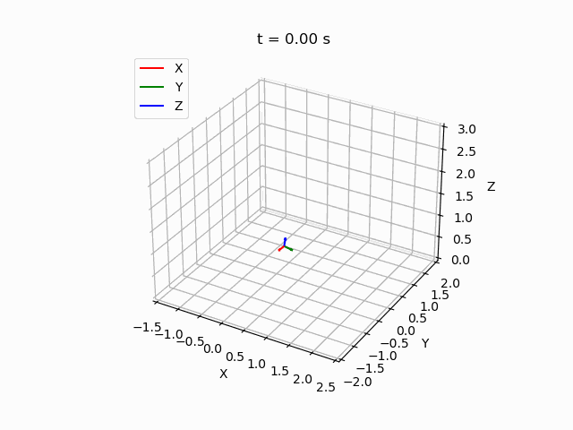

# Robotics I – Final Project (2023–2024)

This repository contains the complete implementation of the **Robotics I final project** at the Hellenic Mediterranean University (HMuT – Electrical & Computer Engineering).

## Project Overview

The project is organized into three parts (A, B, C), following a bottom-up approach from geometric vector operations to robot kinematics and motion planning. The simulated mechanism is a **PRR (Prismatic-Revolute-Revolute)** robotic arm.

### PART A – Vector Geometry & Frame Visualization

- `plot_free_vec(x, c)`, `plot_vec(a, x, c)` – Vector visualization
- `make_unit(x)` – Normalize a vector
- `project_vec(a, b)` – Projection of one vector onto another
- `cross_demo` – 3D cross product visualization
- `plot_Rot(R)`, `generate_rot()` – Local frames in 3D

###  PART B – Homogeneous Transformations & Applications

- `gRX(th)`, `gRY(th)`, `gRZ(th)` – Return rotation matrix for angle `th` (in degrees) around X, Y, Z axis respectively
- `gr(R)`, `gp(p)` – Create homogeneous transformation matrices from rotation `R` or translation vector `p`
- `homogen(R, p)` – Construct full homogeneous transformation matrix from rotation and translation
- `rotAndTranVec(G, vin)` – Apply homogeneous transformation `G` to a 3D input vector `vin`
- `plot_hom(G)` – Visualize the local coordinate frame using colored 3D arrows
- `rotX(th)`, `rotY(th)`, `rotZ(th)` – Return rotation matrix for angle `th` (in degrees) around X, Y, Z axis respectively
- `rotAndTrans_shape()` – Apply full transformation to 3D geometry (e.g., a cylinder)


### PART C – PRR Robot and Kinematics

- `g0e(q1, q2, q3)` – Forward kinematics
- `ikine(p, ...)` – Inverse kinematics via brute-force search
- `get_trajectory()` – Quintic interpolation of position
- Full 3D animated demos of end-effector trajectories

---

##  Animation Previews

These animated demonstrations visualize the robot's end-effector pose and motion planning in 3D:

### 1. Joint Space Trajectory

> Movement from an initial to a final joint configuration:  
> `q0 = [0.9, -0.7, -0.35] → qf = [2.0, 1.22, 2.53]`


---

### 2. Task Space Trajectory

> Movement of the end-effector from one point in workspace to another using inverse kinematics.  
> From `p0 = [0.5, -0.5, 1.0]` to `pf = [1.0, 0.8, 1.8]`.



---

### 3. Dance Demo – Periodic Sinusoidal Trajectory

> A periodic trajectory with sinusoidal variation in all directions (X, Y, Z).  
> Demonstrates continuous motion control and trajectory following.


---

## Error Plot (Dance Demo)

> Below is the inverse kinematics solution error for the `dance_demo` trajectory:


---

## Files Included

- `robotic_lab.ipynb` – Jupyter Notebook with all exercises
- `*.gif` – Animated trajectories
- `*.png` – Velocity/position/error plots
- `README.md` – This file

---

##  Requirements

Install the dependencies via pip:

```bash
pip install -r requirements.txt
